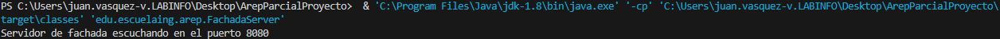

# Parcial
Descargar el proyecto del repositorio https://github.com/Sebasvasquezz/ArepParcialProyecto

### Instalación

1. Clona el repositorio y navega al directorio del proyecto:
    ```sh
    git clone https://github.com/Sebasvasquezz/ArepParcialProyecto.git
    cd Parcial1_AREP
    ```

2. Compila el proyecto:
    ```sh
    mvn package
    ```

    Deberías ver una salida similar a esta:
    ```sh
    [INFO] Building jar: C:\Users\juan.vasquez-v.LABINFO\Desktop\ArepParcialProyecto\target\parcial-1.0-SNAPSHOT.jar
    [INFO] ------------------------------------------------------------------------
    [INFO] BUILD SUCCESS
    [INFO] ------------------------------------------------------------------------
    [INFO] Total time:  12.242 s
    [INFO] Finished at: 2024-09-12T17:05:12-05:00
    [INFO] ------------------------------------------------------------------------
    ```

3. Ejecuta  el servicio de fachada en una terminal:
    ```sh
    java -cp target/parcial-1.0-SNAPSHOT.jar edu.escuelaing.arep.FachadaServer 
    
    o

    & 'C:\Program Files\Java\jdk-1.8\bin\java.exe' '-cp' 'C:\Users\juan.vasquez-v.LABINFO\Desktop\ArepParcialProyecto\target\classes' 'edu.escuelaing.arep.FachadaServer'
    ```

    Al ejecutar la aplicación, deberías ver lo siguiente:
    
    

    Luego ejecuta el servicio de la calculadora en otra terminal :

     ```sh
    java -cp target/parcial-1.0-SNAPSHOT.jar edu.escuelaing.arep.ReflexCalculator 
    
    o

    & 'C:\Program Files\Java\jdk-1.8\bin\java.exe' '-cp' 'C:\Users\juan.vasquez-v.LABINFO\Desktop\ArepParcialProyecto\target\classes' 'edu.escuelaing.arep.ReflexCalculator
    ```

    Al ejecutar la aplicación, deberías ver lo siguiente:
    

 
    
    ## Ejemplo de uso

    * Ahora puedes acceder al siguiente [link](http://localhost:8080/calculadora):
    
    * Ingresar un metodo de math o bbl, click en calcular y se obtiene el resultado:
    

